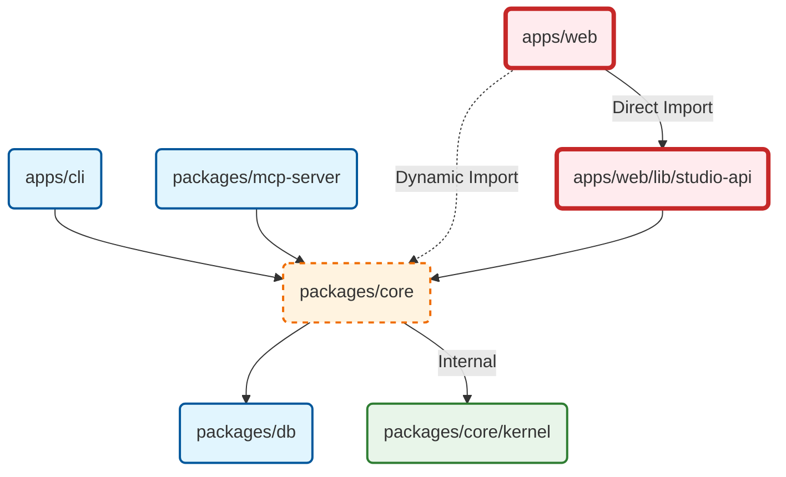

# Zeo Runtime Classification Map

## 1. Runtime Environments

| Environment | ID | Characteristics | Constraints |
| :--- | :--- | :--- | :--- |
| **Universal Kernel** | `env:universal` | Pure JS/TS. No I/O. No side effects. | Runs in Browser, Node, Edge, Deno, Bun. 0 dependencies. |
| **Node Infrastructure** | `env:node` | Full OS access. FS, SQLite, Child Process. | Node.js 20+. Local-first. |
| **Web Public** | `env:web:public` | Browser runtime. React. | bundle-size sensitive. No Node built-ins. |
| **Web Studio** | `env:web:studio` | Next.js Server Actions / API Routes. | Can import `env:node` but MUST be isolated from Client Bundles. |

## 2. Package Classification

| Package | Current Classification | Target Classification | Status |
| :--- | :--- | :--- | :--- |
| `@zeo/core` | `env:node` (Monolith) | `env:node` (Orchestrator) | ⚠️ Too heavy. Exports mixed content. |
| `@zeo/core/kernel` | `env:universal` | `env:universal` | ✅ Good separation, needs extraction. |
| `@zeo/cli` | `env:node` | `env:node` | ✅ Correct. |
| `@zeo/mcp-server` | `env:node` | `env:node` | ✅ Correct. |
| `@zeo/db` | `env:node` | `env:node` | ✅ Correct (Prisma/SQLite). |
| `apps/web` | `env:mixed` (Dangerous) | `env:web:public` | 🚨 CRITICAL: Imports `@zeo/core`. |
| `apps/web/src/lib/studio-api`| `env:web:studio` | `env:node` (Dedicated Pkg) | ⚠️ Logic leak. Should be in `@zeo/studio-server`. |

## 3. Dependency Graph & Risk Analysis

### Risk Assessment
- **High**: `apps/web` pulling in `@zeo/core` means `better-sqlite3` is in the dependency tree for the frontend build. This relies entirely on Next.js/Webpack tree-shaking and "server-only" guards, which is fragile.
- **Medium**: `@zeo/core` exports `client.ts` which throws runtime errors. This is technical debt that confuses consumers.
- **Low**: CLI/MCP coupling is acceptable as they share the same runtime requirements.
